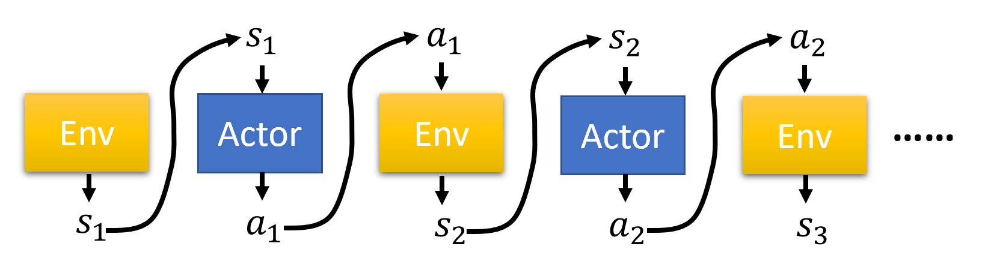
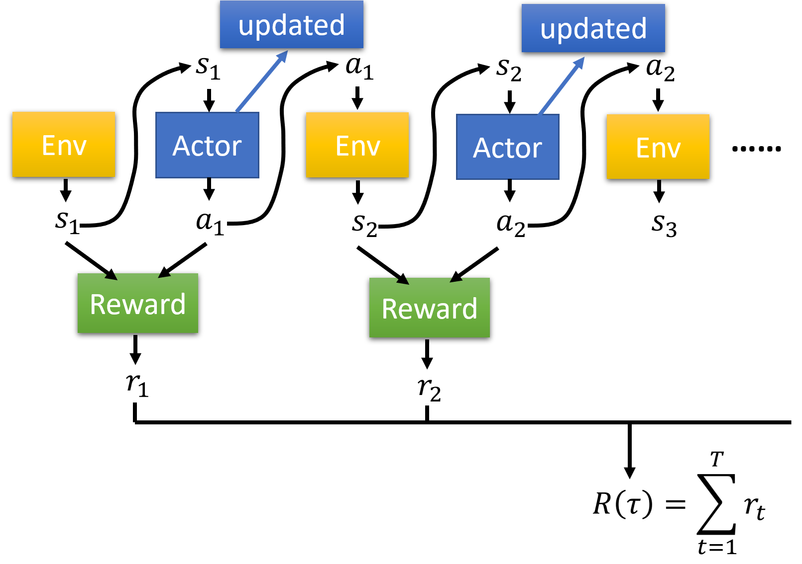
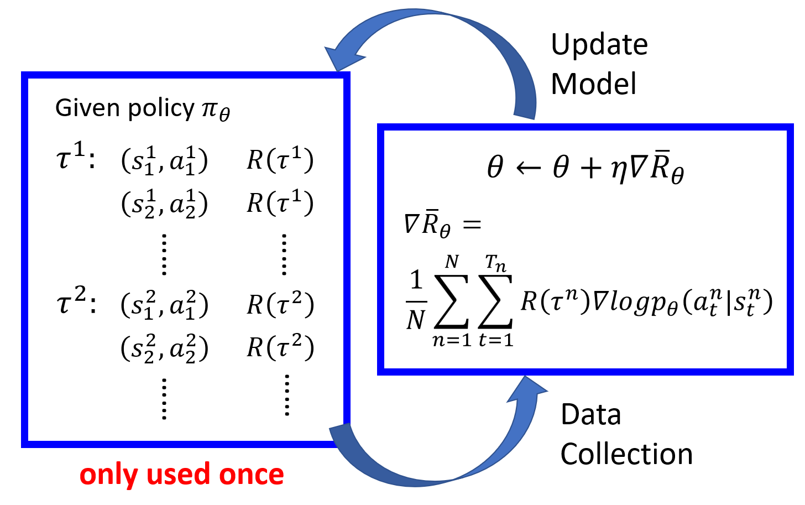
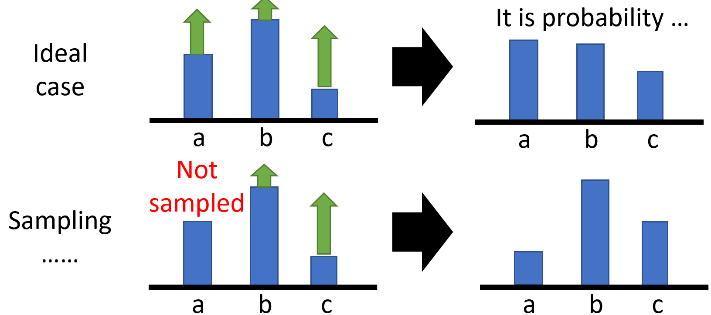
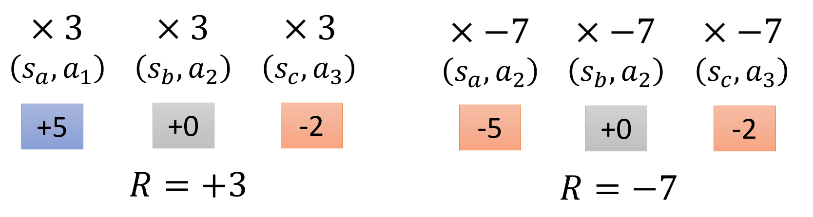
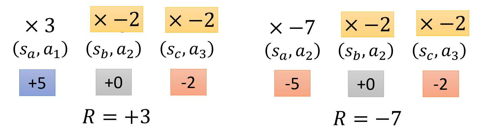

# DRL(Deep Reinforced Learning)

> 参考[李宏毅老师的课程](https://www.youtube.com/watch?v=z95ZYgPgXOY&t=1292s)
>
> github上对公式排版显示很不友好，阅读建议访问[csdn主页](https://blog.csdn.net/weixin_48435461?spm=1000.2115.3001.5343)，同步更新

## policy gradient

有三个基础的组成部分 （坦克大战为例）

* actor （坦克控制器）
* environments （游戏界面交互）
* reward function  （击败敌方坦克获得奖励）

env 和 reward function 是无法控制的

调整actor中的policy，来获得最大的reward  （控制坦克达成最大击杀）

policy决定actor的行为， policy部分就是一个network（即下图的Actor就是一个网络，可以通过网络来算出 $a_i$ ）

reward不是标量（scalar）而是随机变量（random variable）

$$
\text{Trajectory } \tau = \{s_1, a_1, s_2, a_2, \ldots, s_T, a_T\}
$$

$$
p_\theta(\tau) = p(s_1)p_\theta(a_1|s_1)p(s_2|s_1,a_1)p_\theta(a_2|s_2)p(s_3|s_2,a_2)\dots \\
= p(s_1)\prod_{t=1}^T p_\theta(a_t|s_t)p(s_{t+1}|s_t,a_t)
$$

轨迹 $\tau$ 是走完整个行动的流程；

actor的参数给定为 $\theta$  ，在参数确定的情况下，走完轨迹 $\tau$ 的概率是 $p_\theta(\tau)$ 

$$
\bar{R}_\theta = \sum_{\tau} R(\tau)p_\theta(\tau) = E_{\tau \sim p_\theta} [R(\tau)]
$$
我们希望更新actor中的参数 $\theta$ ，来使得获得的奖励函数 $R(\tau)$ 的均值（也就是期望）越大越好

如何求 $\bar{R}_\theta$ 的梯度 $\nabla\bar{R}_\theta$ ，来对actor中的参数 $\theta$ 进行策略梯度更新？  $\eta$  为学习率
$$
\theta \leftarrow \theta + \eta \nabla \bar{R}_\theta
$$
由  $\nabla f(x) = f(x) \nabla \log f(x)$​  可以推出下述公式

$$
\nabla \bar{R}_\theta = \sum_{\tau} R(\tau) \nabla p_\theta(\tau) = \sum_{\tau} R(\tau) p_\theta(\tau) \frac{\nabla p_\theta(\tau)}{p_\theta(\tau)}= \sum_{\tau} R(\tau) p_\theta(\tau) \nabla \log p_\theta(\tau)\\= E_{\tau \sim p_\theta(\tau)}[R(\tau) \nabla \log p_\theta(\tau)] \approx \frac{1}{N} \sum_{n=1}^N R(\tau^n) \nabla \log p_\theta(\tau^n) \\
= \frac{1}{N} \sum_{n=1}^N \sum_{t=1}^{T_n} R(\tau^n) \nabla \log p_\theta(a_t^n | s_t^n)
$$

> $\nabla f(x) = f(x) \nabla \log f(x)$ 记住就行，是一个定理公式
>
> $R(\tau)$​ 不要求可微，即使是黑盒也可以

表示为：

$$
\nabla \bar{R}_\theta =E_{\tau \sim p_\theta(\tau)}[R(\tau) \nabla \log p_\theta(\tau)]
$$

上图表示我们处理策略梯度时的流程，通过采样一批 $\tau^i$ 来作为一个 $\theta$ 更新的数据集，在更新完参数 $\theta$ 后，再重新采样一批 $\tau^i$ 继续更新；每次采样的 $\tau$ 只使用一次。因为其一直在与环境交互（即采样的 $\tau$ 都来自环境），所以也被称为 on-policy gradient 

需要注意的是，$R(\tau^n)$​ 在每一步计算梯度时都要作为一个权重被乘上去。

### Tip 1

需要注意的是，我们在实际情况下采样并不能将所有情况都囊括其中，以下图为例，我们可能没有采样到 a 的情况，这会导致在梯度更新后，actor 选择 a 的概率降低；但实际上选择 a 也会提高 reward ，只是我们没有采样到...

所以我们会优化策略梯度函数：
$$
\nabla \bar{R}_\theta \approx \frac{1}{N} \sum_{n=1}^N \sum_{t=1}^{T_n} (R(\tau^n) - b) \nabla \log p_\theta(a_t^n | s_t^n) \quad \text{where } b \approx E[R(\tau)]
$$
加入一个bias（b）来平衡这个问题，如果奖励不够，策略梯度就是负数。

### Tip 2

根据公式 $\nabla \bar{R}_\theta \approx \frac{1}{N} \sum_{n=1}^N \sum_{t=1}^{T_n} (R(\tau^n) - b) \nabla \log p_\theta(a_t^n | s_t^n) $ 可以知道，$R(\tau^n) - b$ 会作为权重乘在每一次的 $\log p_\theta(a_t^n | s_t^n)$ 中。但以下图的两个例子来说：

* 左边的 R = +3 说明最终的奖励是 +3 ，但是第一次的行动是 +5 ，第二次是 0 、第三次是 -2 ，说明第三次的行动被第二次影响了，如果没有第二次的行动，第三次行动可能就不会扣分。
* 右边的 R = -7 说明最终的奖励是 -7 ，但是如果没有第二次的行动 +0 ，可能第三次的行动就不仅仅会扣两分了，可能会扣的更多

所以我们不能简单的将整体的奖励 $R$ 作为权重来进行计算，要结合每一步的奖励进行计算

* 左边第二次、第三次行动的奖励权重为 -2 而不是乘上整体的奖励 3
* 右边的第二次、第三次行动的奖励权重为 -2 而不是乘上 -7

参考下述公式
$$
\nabla \bar{R}_\theta \approx \frac{1}{N} \sum_{n=1}^N \sum_{t=1}^{T_n} (\sum_{t'=t}^{T_n} r_{t'}^n
 - b) \nabla \log p_\theta(a_t^n | s_t^n) \quad \text{where } b \approx E[R(\tau)]
$$
其中
$$
R(\tau^n) \rightarrow \sum_{t'=t}^{T_n} r_{t'}^n
$$
但由于随着行动次数越长，最开使的奖励影响越小，所以我们也要加入一个缩放因子来减少远距离时，奖励作为权重带来的影响
$$
\sum_{t'=t}^{T_n} r_{t'}^n \rightarrow \sum_{t'=t}^{T_n} \gamma^{t'-t} r_{t'}^n \quad \text{where } \gamma < 1
$$
在上述的推导步骤中，奖励的变化（即 $R(\tau^n) - b$ ）可以看作是一个函数：
$$
R(\tau^n) - b =A^\theta(s_t, a_t)
$$
其中 $A = \text{Advantage Function } $ ，这个函数的意义就是我们在 $s_t$ 的情况下执行 $a_t$ 相较于其他的行动能有多好

## PPO(Proximal Policy Optimization)

是Openai默认的强化学习策略

* On-policy：学习的agent和与环境交互的agent是同一个

$$
\nabla \bar{R}_\theta = E_{\tau \sim p_\theta(\tau)}[R(\tau) \nabla \log p_\theta(\tau)]
$$

* Off-policy：学习的agent和与环境交互的agent不同

> 这里的agent可以理解为上文的 actor

$$
\nabla \bar{R}_\theta = E_{\tau \sim p_{\theta'}(\tau)}\left[\frac{p_\theta(\tau)}{p_{\theta'}(\tau)} R(\tau) \nabla \log p_\theta(\tau)\right]
$$

为什么要off-policy ？

因为在on-policy时，你每一次采样后的 $\tau$ 只能用一次，在更新 $\theta$ 参数后就得重新采样

变成off-policy的好处就是一次采样多次使用，不在原始分布 $p(x)$ 上采样，而是在伪分布 $q(x)$ 上采样，然后来训练 $p(x)$ 分布的参数 $\theta$ 

在做 off-policy 时，我们补充下述方法和公式推导

### Importance Sampling

$$
E_{x \sim p}[f(x)] \approx \frac{1}{N} \sum_{i=1}^N f(x^i)= \int f(x) p(x) \, dx = \int f(x) \frac{p(x)}{q(x)} q(x) \, dx = E_{x \sim q}\left[f(x) \frac{p(x)}{q(x)}\right]
$$

* 原来 $x_i$ 是从 $p(x)$ 分布中去抓取，但是通过上述推导，我们可以从 $q(x)$ 分布中抓取 $x_i$ 
* $p(x)$ 分布是实际分布， $q(x)$ 分布是模仿实际分布的伪分布

在有伪分布 $q(x)$ 后，我们就可以从中抽取 $\theta^{'}$ 来训练 $\theta$ ，由于 $\theta^{'}$ 是固定的，所以可以重复使用，不用再像之前的 $\theta$ 一样每次都得更新。 

但importance sampling 也有一些问题：**方差会不一样** 

> 方差公式：$Var[X] = E[X^2]-(E[X])^2$

$$
\text{Var}_{x \sim p}[f(x)] = E_{x \sim p}[f(x)^2] - (E_{x \sim p}[f(x)])^2
$$

$$
\text{Var}_{x \sim q}\left[f(x) \frac{p(x)}{q(x)}\right] = E_{x \sim q}\left[\left(f(x) \frac{p(x)}{q(x)}\right)^2\right] - \left(E_{x \sim q}\left[f(x) \frac{p(x)}{q(x)}\right]\right)^2 \\ = \int q(x)f(x)^2\frac{p(x)^2}{q(x)^2}dx - \int q(x)^2f(x)^2\frac{p(x)^2}{q(x)^2}dx \\= E_{x \sim p}[f(x)^2\frac{p(x)}{q(x)}] - \left(E_{x \sim p}[f(x)]\right)^2
$$

观察上述两个方差等式我们可以看到，如果 $p(x)$ 分布和 $q(x)$ 分布一样，需要满足下述等式
$$
E_{x \sim p}[f(x)] = E_{x \sim q}\left[f(x) \frac{p(x)}{q(x)}\right]
$$
如果 $ \frac{p(x)}{q(x)}$ 差距很大，即实际分布和伪分布相差很多，那么实际方差与估计方差就会有很大的差距

> 理想状态下，只要有足够多的采样，上述问题就不是问题。但是实际情况是我们无法做到采样足够多的样本，所以 $E_{x \sim p}[f(x)] = E_{x \sim q}\left[f(x) \frac{p(x)}{q(x)}\right]$ 的左右两侧会产生很大的差别

### 梯度更新

$$
\text{gradient for update} = E_{(s_t,a_t) \sim \pi_\theta} \left[ A^\theta(s_t, a_t) \nabla \log p_\theta(a_t | s_t) \right] \\= E_{(s_t,a_t) \sim \pi_{\theta'}} \left[ \frac{p_\theta(s_t, a_t)}{p_{\theta'}(s_t, a_t)} A^\theta(s_t, a_t) \nabla \log p_\theta(a_t | s_t) \right] \\ = E_{(s_t,a_t) \sim \pi_{\theta'}} \left[ \frac{p_\theta(a_t | s_t) p_\theta(s_t)}{p_{\theta'}(a_t | s_t) p_{\theta'}(s_t)} A^\theta(s_t, a_t) \nabla \log p_\theta(a_t | s_t) \right]
$$

其中 $\frac{p_\theta(s_t)}{p_{\theta'}(s_t)}$ 默认相等然后约掉（因为不好算，所以认为他们近似等价并约分）

有推导公式 $\nabla f(x) = f(x) \nabla \log f(x)$ ，观察上述梯度等式可以发现，
$$
f(x) =p_\theta(a_t | s_t)\\ \nabla \log f(x)=\nabla \log p_\theta(a_t | s_t)
$$
所以
$$
\nabla f(x)=f(x) \nabla \log f(x) =p_\theta(a_t | s_t)\nabla \log p_\theta(a_t | s_t)=\nabla p_\theta(a_t | s_t)
$$
即梯度为
$$
\nabla = E_{(s_t,a_t) \sim \pi_{\theta'}} \left[ \frac{\nabla p_\theta(a_t | s_t)}{p_{\theta'}(a_t | s_t) } A^{\theta'}(s_t, a_t) \right]
$$
由梯度可以推出关于 $\theta'$ 的奖励目标函数
$$
J^{\theta'}(\theta) = E_{(s_t, a_t) \sim \pi_{\theta'}} \left[ \frac{p_\theta(a_t | s_t)}{p_{\theta'}(a_t | s_t)} A^{\theta'}(s_t, a_t) \right]
$$

### PPO算法

$$
J^{k}_{PPO}(\theta) = J^{\theta^k}(\theta) - \beta KL(\theta, \theta^k)\\

J^{\theta^k}(\theta) \approx \sum_{(s_t, a_t)} \frac{p_\theta(a_t | s_t)}{p_{\theta^k}(a_t | s_t)} A^{\theta^k}(s_t, a_t)\\
\text{If } KL(\theta, \theta^k) \geq KL_{\text{max}}, \text{ increase } \beta \\
\text{If } KL(\theta, \theta^k) \leq KL_{\text{min}}, \text{ decrease } \beta \\
$$

在后面加上了KL散度

* 初始化策略参数  $\theta^0$。
* 在每次迭代中：
  * 使用 $\theta^k$ 与环境交互，收集 $\{s_t, a_t\}$，并计算优势 $A^{\theta^k}(s_t, a_t)$。
  * 找到优化 $J_{PPO}(\theta)$的 $\theta$。

### PPO的第二种方式

$$
J_{PPO2}^{\theta^k}(\theta) \approx \sum_{(s_t, a_t)} \min \left( \frac{p_\theta(a_t | s_t)}{p_{\theta^k}(a_t | s_t)} A^{\theta^k}(s_t, a_t), \text{clip}\left(\frac{p_\theta(a_t | s_t)}{p_{\theta^k}(a_t | s_t)}, 1 - \xi, 1 + \xi\right) A^{\theta^k}(s_t, a_t) \right)
$$

clip是一个选择函数

* 当 $\frac{p_\theta(a_t | s_t)}{p_{\theta^k}(a_t | s_t)} < 1 -\xi$ 时选 $1 -\xi$
* 当$\frac{p_\theta(a_t | s_t)}{p_{\theta^k}(a_t | s_t)} > 1 +\xi$ 时选 $1 +\xi$

* 当 $1 -\epsilon < \frac{p_\theta(a_t | s_t)}{p_{\theta^k}(a_t | s_t)} < 1 +\xi$ 时选 $\frac{p_\theta(a_t | s_t)}{p_{\theta^k}(a_t | s_t)}$

> 绿线是 $\frac{p_\theta(a_t | s_t)}{p_{\theta^k}(a_t | s_t)} A^{\theta^k}(s_t, a_t)$的范围
>
> 蓝线是clip选择后的范围
>
> x轴是 $\frac{p_\theta(a_t | s_t)}{p_{\theta^k}(a_t | s_t)}$​ 的比值
>
> 我们不希望真实分布 $p_\theta(x)$ 和伪分布 $p_{\theta'}(x)$ 相差太大，也就是这个比值最好是在1左右
>
> 这里尝试对上图进行解释：
>
> * 当 $A > 0$ 时，说明 s 和 a 获得的奖励是好的，说明此时 $p_\theta(a_t | s_t)$ 做出的决策是正确的，我们希望它越大越好，此时目标函数（红线）会把概率往上推，但只能推到一定的程度
> * 当 $A < 0$ 时，说明 s 和 a 获得的奖励是好的，说明此时 $p_\theta(a_t | s_t)$ 做出的决策是错误的，我们希望它越小越好，此时目标函数（红线）就把概率往下推，但也不会推的很小
