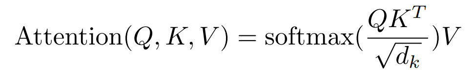
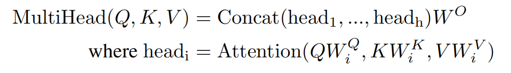

# Pytorch手撸Attention

注释写的很详细了，对照着公式比较下更好理解，可以参考一下[知乎的文章](https://zhuanlan.zhihu.com/p/410776234)

## 注意力机制



```python
import torch
import torch.nn as nn
import torch.nn.functional as F


class SelfAttention(nn.Module):
    def __init__(self, embed_size):
        super(SelfAttention, self).__init__()
        self.embed_size = embed_size

        # 定义三个全连接层，用于生成查询（Q）、键（K）和值（V）
        # 用Linear线性层让q、k、y能更好的拟合实际需求
        self.value = nn.Linear(embed_size, embed_size)
        self.key = nn.Linear(embed_size, embed_size)
        self.query = nn.Linear(embed_size, embed_size)

    def forward(self, x):
        # x 的形状应为 (batch_size批次数量, seq_len序列长度, embed_size嵌入维度)
        batch_size, seq_len, embed_size = x.shape

        Q = self.query(x)
        K = self.key(x)
        V = self.value(x)
        
        # 计算注意力分数矩阵
        # 使用 Q 矩阵乘以 K 矩阵的转置来得到原始注意力分数
        # 注意力分数的形状为 [batch_size, seq_len, seq_len]
        # K.transpose(1,2)转置后[batch_size, embed_size, seq_len]
        # 为什么不直接使用 .T 直接转置？直接转置就成了[embed_size, seq_len,batch_size]，不方便后续进行矩阵乘法
        attention_scores = torch.matmul(Q, K.transpose(1, 2)) / torch.sqrt(
            torch.tensor(self.embed_size, dtype=torch.float32))

        # 应用 softmax 获取归一化的注意力权重，dim=-1表示基于最后一个维度做softmax
        attention_weight = F.softmax(attention_scores, dim=-1)

        # 应用注意力权重到 V 矩阵，得到加权和
        # 输出的形状为 [batch_size, seq_len, embed_size]
        output = torch.matmul(attention_weight, V)

        return output
```

## 多头注意力机制



```python
class MultiHeadAttention(nn.Module):
    def __init__(self, embed_size, num_heads):
        super().__init__()
        self.embed_size = embed_size
        self.num_heads = num_heads
        # 整除来确定每个头的维度
        self.head_dim = embed_size // num_heads
		
        # 加入断言，防止head_dim是小数，必须保证可以整除
        assert self.head_dim * num_heads == embed_size

        self.q = nn.Linear(embed_size, embed_size)
        self.k = nn.Linear(embed_size, embed_size)
        self.v = nn.Linear(embed_size, embed_size)
        self.out = nn.Linear(embed_size, embed_size)

    def forward(self, query, key, value):
        # N就是batch_size的数量
        N = query.shape[0]
        
        # *_len是序列长度
        q_len = query.shape[1]
        k_len = key.shape[1]
        v_len = value.shape[1]
		
        # 通过线性变换让矩阵更好的拟合
        queries = self.q(query)
        keys = self.k(key)
        values = self.v(value)
		
        # 重新构建多头的queries,permute调整tensor的维度顺序
        # 结合下文demo进行理解
        queries = queries.reshape(N, q_len, self.num_heads, self.head_dim).permute(0, 2, 1, 3)
        keys = keys.reshape(N, k_len, self.num_heads, self.head_dim).permute(0, 2, 1, 3)
        values = values.reshape(N, v_len, self.num_heads, self.head_dim).permute(0, 2, 1, 3)
		
        # 计算多头注意力分数
        attention_scores = torch.matmul(queries, keys.transpose(-2, -1)) / torch.sqrt(
            torch.tensor(self.head_dim, dtype=torch.float32))
        attention = F.softmax(attention_scores, dim=-1)
		
        # 整合多头注意力机制的计算结果
        out = torch.matmul(attention, values).permute(0, 2, 1, 3).reshape(N, q_len, self.embed_size)
        # 过一遍线性函数
        out = self.out(out)

        return out
```

## demo测试

#### self-attention测试

```python
# 测试自注意力机制
batch_size = 2
seq_len = 3
embed_size = 4

# 生成一个随机数据 tensor
input_tensor = torch.rand(batch_size, seq_len, embed_size)

# 创建自注意力模型实例
model = SelfAttention(embed_size)

# print输入数据
print("输入数据 [batch_size, seq_len, embed_size]:")
print(input_tensor)

# 运行自注意力模型
output_tensor = model(input_tensor)

# print输出数据
print("输出数据 [batch_size, seq_len, embed_size]:")
print(output_tensor)
```

```bash
输入数据 [batch_size, seq_len, embed_size]:
tensor([[[0.7579, 0.7342, 0.1031, 0.8610],
         [0.8250, 0.0362, 0.8953, 0.1687],
         [0.8254, 0.8506, 0.9826, 0.0440]],

        [[0.0700, 0.4503, 0.1597, 0.6681],
         [0.8587, 0.4884, 0.4604, 0.2724],
         [0.5490, 0.7795, 0.7391, 0.9113]]])

输出数据 [batch_size, seq_len, embed_size]:
tensor([[[-0.3714,  0.6405, -0.0865, -0.0659],
         [-0.3748,  0.6389, -0.0861, -0.0706],
         [-0.3694,  0.6388, -0.0855, -0.0660]],

        [[-0.2365,  0.4541, -0.1811, -0.0354],
         [-0.2338,  0.4455, -0.1871, -0.0370],
         [-0.2332,  0.4458, -0.1867, -0.0363]]], grad_fn=<UnsafeViewBackward0>)
```

#### MultiHeadAttention

多头注意力机制务必自己debug一下，主要聚焦在理解如何拆分成多头的，不结合代码你很难理解多头的操作过程

1、`queries.reshape(N, q_len, self.num_heads, self.head_dim).permute(0, 2, 1, 3)` 处理之后的 `size = torch.Size([64, 8, 10, 16])`

- 通过上述操作，`queries` 张量的最终形状变为 `[N, self.num_heads, q_len, self.head_dim]`。这样的排列方式使得每个注意力头可以单独处理对应的序列部分，而每个头的处理仅关注其分配到的特定维度 `self.head_dim`
- 这个形状是为了后续的矩阵乘法操作准备的，其中每个头的查询将与对应的键进行点乘，以计算注意力分数

2、`attention_scores = torch.matmul(queries, keys.transpose(-2, -1)) / torch.sqrt(
            torch.tensor(self.head_dim, dtype=torch.float32))` 将reshape后的`quries`的后两个维度进行转置后点乘，对应了 $Q \cdot K^T$ ；根据demo这里的头数为8，所以公式中对应的下标 $i$ 为8

 3、在进行完多头注意力机制的计算后通过 `torch.matmul(attention, values).permute(0, 2, 1, 3).reshape(N, q_len, self.embed_size)` 整合，变回原来的 `[batch_size,seq_length,embed_size]`形状

```python
# 测试多头注意力
embed_size = 128  # 嵌入维度
num_heads = 8    # 头数
attention = MultiHeadAttention(embed_size, num_heads)

# 创建随机数据模拟 [batch_size, seq_length, embedding_dim]
batch_size = 64
seq_length = 10
dummy_values = torch.rand(batch_size, seq_length, embed_size)
dummy_keys = torch.rand(batch_size, seq_length, embed_size)
dummy_queries = torch.rand(batch_size, seq_length, embed_size)

# 计算多头注意力输出
output = attention(dummy_values, dummy_keys, dummy_queries)
print(output.shape)  # [batch_size, seq_length, embed_size]
```

```bash
torch.Size([64, 10, 128])
```

> 如果你难以理解权重矩阵的拼接和拆分，推荐[李宏毅的attention课程（YouTobe）](https://www.youtube.com/watch?v=hYdO9CscNes)