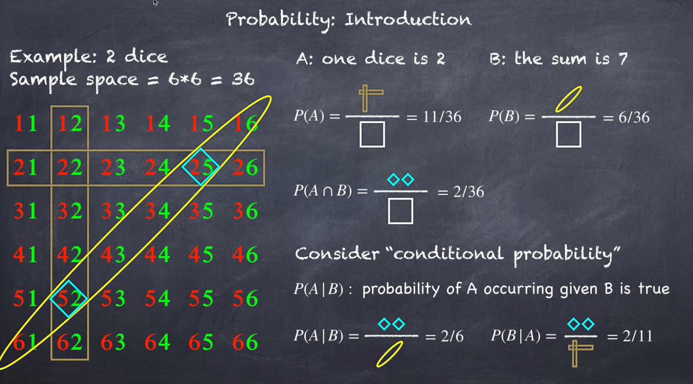
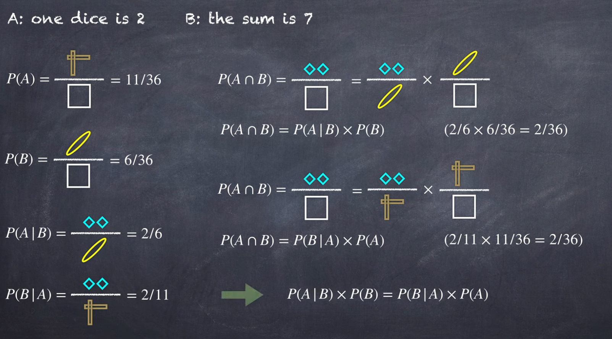

# 贝叶斯公式

 参考：[YouTobe](https://www.youtube.com/watch?v=Pu675cHJ7bg)

## 案例引入

$$
P(A|B)=\frac{P(B|A)P(A)}{P(B)}
$$

$$
P(A\cap B)=P(A|B)\times P(B)=P(B|A)\times P(A)
$$

下图给出抛骰子的例子，解释如何推出贝叶斯公式

## 贝叶斯通式

$$
P(H|E)=\frac{P(E|H)P(H)}{P(E)}\ \ \ E=Evidence\ ,\ H=Hypothesis
$$

贝叶斯定理关注的是：**在已知的证据下，假设成立的概率有多大**

## 公式推理

以上图为参考进行下述公式推理：

$$
\bar H:not\ H\ \ \ \ \ \ \ \ P(\bar H)=1-P(H)
$$

$$
P(E)=P(E\cap H)+P(E\cap \bar H)=P(E|H)P(H)+P(E|\bar H)P(\bar H)
$$

$$
P(H|E)=\frac{P(E|H)P(H)}{P(E|H)P(H)+P(E|\bar H)P(\bar H)}
$$

可以看到贝叶斯公式中分母为证据 $E$ 的概率，但是我们有时并不知道证据 $E$ 的概率，需要通过条件概率来计算 $P(E)$

## 举例理解

### 案例一

小明是一个内敛的人，他总是乐于助人，有一个温顺整洁的灵魂，他总是对自己有所要求，并规矩的生活，对细节非常在意。请问小明更可能是农民还是图书管理员？

Fact：图书管理员与农民的比例是1：50

|            | 样本空间 | 符合条件 | 概率 |
| ---------- | -------- | -------- | ---- |
| 图书管理员 | 10       | 5        | 9%   |
| 农民       | 500      | 50       | 91%  |

接下来用贝叶斯公式进行推导：

$E:statement\ \ by\ \ people$

$P(H):P(librarian)=\frac{1}{1+50}=0.0196$

$P(\bar H):P(farmer)=\frac{50}{1+50}=0.9804$

假设：$P(E|H)=0.5$    $P(E|\bar H)=0.1$
$$
P(H|E)=\frac{P(E|H)P(H)}{P(E|H)P(H)+P(E|\bar H)P(\bar H)}
$$
$P(H|E)=\frac{0.5\times0.0196}{0.5\times0.0196+0.1\times0.9804}=0.0909$

所以得出：在证据 $E$ 成立（人们对小明的描述）的情况下， $H$ 事件（假设小明为图书管理员）发生的概率为 9.09%

### 案例二

你被检验出可能有一种罕见疾病

* 在人群中只有0.1%的人会得病

这个测试非常准确

* 如果有这个疾病，检查准确率达到99%
* 如果没有这个疾病，会有2%的误诊为患者

|      | 1000人的样本空间 | 阳性 | 概率              |
| :--- | :--------------- | :--- | :---------------- |
| 疾病 | 1                | 1    | $\frac{1}{20+1}$  |
| 健康 | 999              | 20   | $\frac{20}{20+1}$ |

带入贝叶斯公式

$E$ : 你被检验出有罕见病

$P(H):患病概率=0.001$ （先验概率）

$P(\bar H)=0.999$  

$P(E|H):sensitivity=0.99$（真阳）

$P(E|\bar H):false\ positive\ rate=0.02$（假阳）
$$
P(H|E)=\frac{P(E|H)P(H)}{P(E|H)P(H)+P(E|\bar H)P(\bar H)}
$$
$P(H|E)=\frac{0.99\times0.001}{0.99\times0.001+0.02\times0.999}=0.0472$（后验概率）

通过贝叶斯计算，你被检验出患有罕见病时，你真正患病的概率只有4.72%

**如果再次检测还是为阳性**

$$
P(H|E)=\frac{P(E|H)P(H)}{P(E|H)P(H)+P(E|\bar H)P(\bar H)}
$$

此时的相关证据与假设概率如下

$P(H)=0.0472$（后验概率：在第一次测得阳性的概率）

$P(\bar H)=0.9528$

$P(E|H):sensitivity=0.99$（真阳）

$P(E|\bar H):false\ positive\ rate=0.02$（假阳）

> 除了假设患病概率以外，其他的不变

$P(H|E)=\frac{0.99\times0.0472}{0.99\times0.0472+0.02\times0.9528}=0.7103$

可以看到，如果两次检测都为阳性，你患病的概率会一下子达到71.03%，与之前的4.72%形成了非常强的对比

上述的**迭代运算**也是贝叶斯的核心精神：通过不断的实验累积证据，从而更精准的判断一个假设是否正确

## 先验概率与后验概率

参考上述例子分析

**先验概率**是你提前已经知晓的概率（假设的实际概率）

而**后验概率**是在证据成立的前提下，确定假设成立的概率

通常情况下，后验概率我们是不得而知，需要通过贝叶斯公式来求得后验概率。所以贝叶斯也是一个求后验概率的公式

